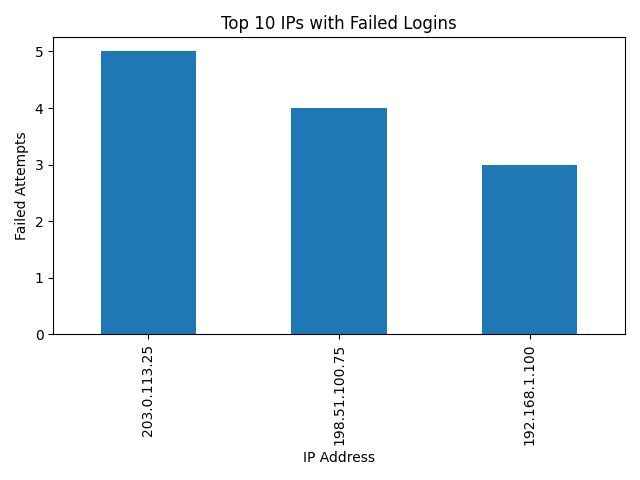

# Log Analysis & Threat Detection System

[](https://www.python.org/)
[](LICENSE)

A Python-based security tool that analyzes authentication logs to detect potential brute-force attacks and visualize suspicious activities.

## Features

- 🔍 Parse authentication logs into structured CSV format
- 🚫 Detect brute-force login attempts using configurable thresholds
- 📊 Generate visual analysis of failed login attempts
- 📝 Create detailed threat reports
- 🔌 Modular design for easy extension

## Installation

1. Clone the repository:

   ```bash
   git clone https://github.com/your-SRsriram8/log-analysis-threat-detection.git
   cd log-analysis-threat-detection
   ```

2. Create and activate a virtual environment:

   ```bash
   python -m venv venv
   source venv/bin/activate  # Linux/macOS
   # or
   venv\Scripts\activate     # Windows
   ```

3. Install dependencies:

   ```bash
   pip install -r requirements.txt
   ```

## Usage

### 1. Parse Authentication Logs

Converts raw auth logs to structured CSV format:

```bash
python src/log_parser.py
```

### 2. Detect Brute-Force Attacks

Analyzes login attempts and generates threat report:

```bash
python src/detect_bruteforce.py
```

### 3. Visualize Results

Creates bar chart of suspicious IP addresses:

```bash
python src/visualize_results.py
```


## Project Structure

```
log-analysis-threat-detection/
├── data/                    
│   └── sample_auth.log     
├── src/                    
│   ├── log_parser.py      
│   ├── detect_bruteforce.py
│   └── visualize_results.py
├── reports/                
│   ├── parsed_logs.csv    
│   ├── threat_report.txt  
│   └── ip_analysis.png    
└── requirements.txt       
```

## Requirements

- Python 3.9+
- pandas >= 1.3.0
- matplotlib >= 3.4.0
- Additional dependencies in [requirements.txt](requirements.txt)

## Sample Output



### Threat Report Example

```
⚠️ Brute-force attack suspected from 192.168.1.50 (6 failed attempts)
⚠️ Brute-force attack suspected from 203.0.113.45 (10 failed attempts)
```

## Contributing

1. Fork the repository
2. Create a feature branch
3. Commit your changes
4. Push to the branch
5. Create a Pull Request

## License

This project is licensed under the MIT License - see the [LICENSE](LICENSE) file for details.
